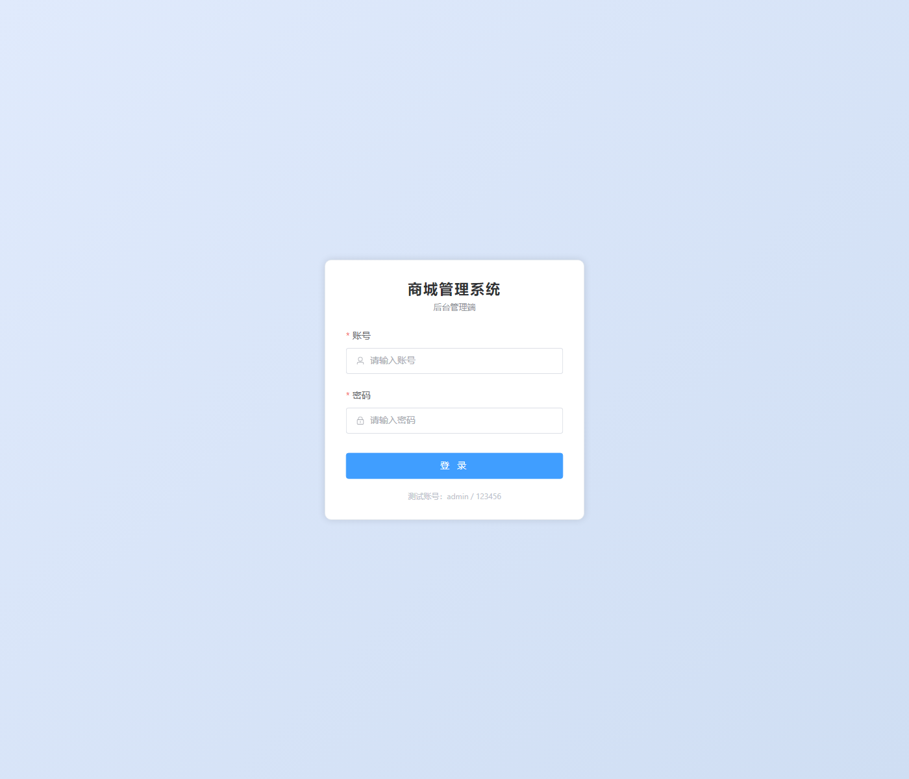
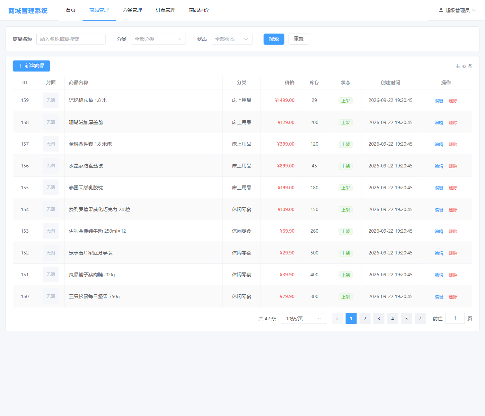
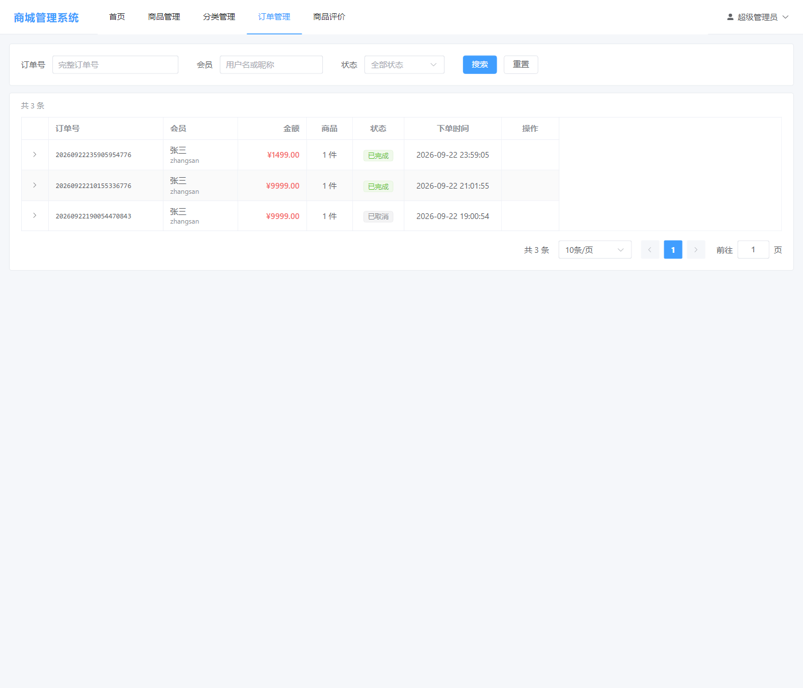
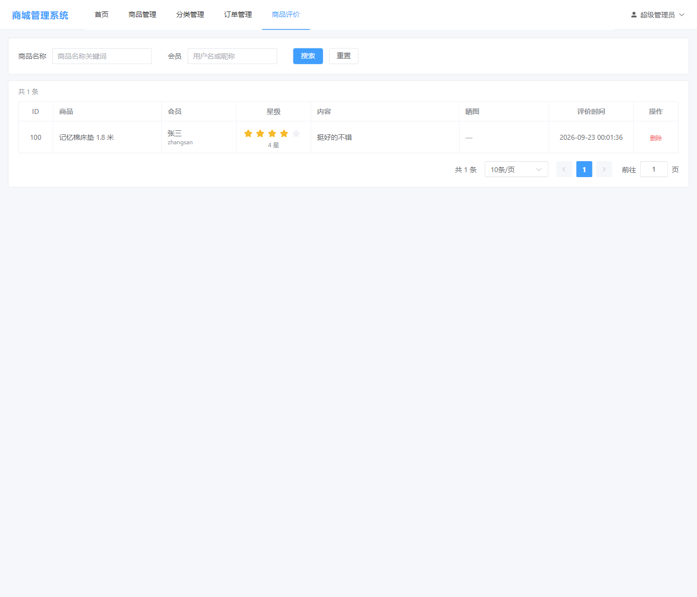
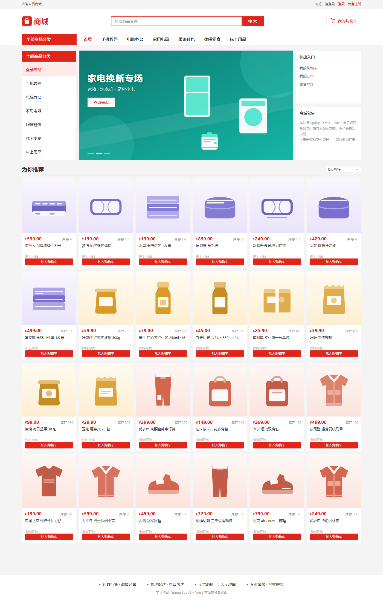
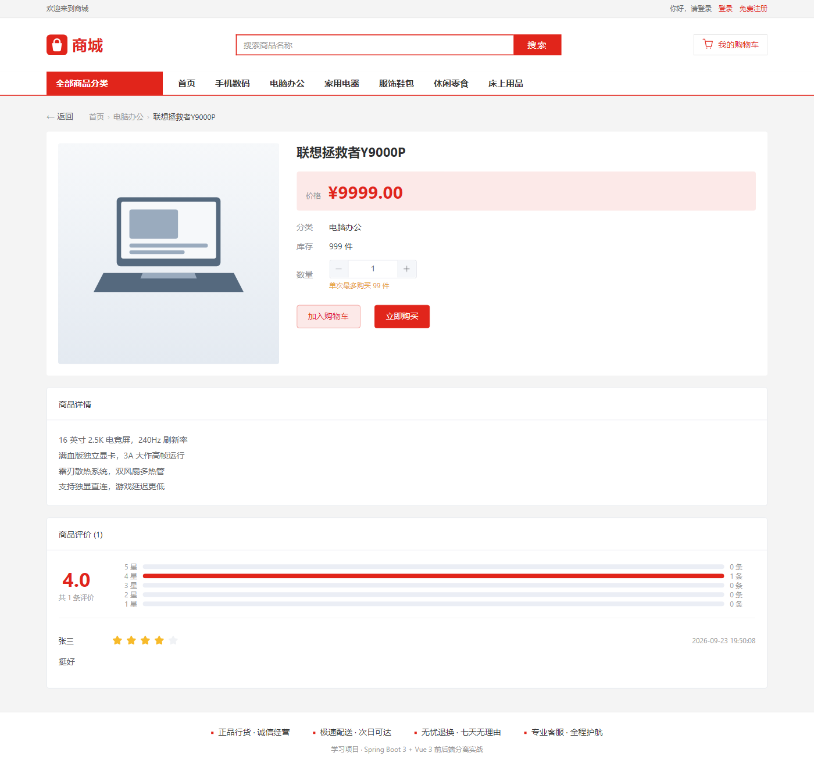
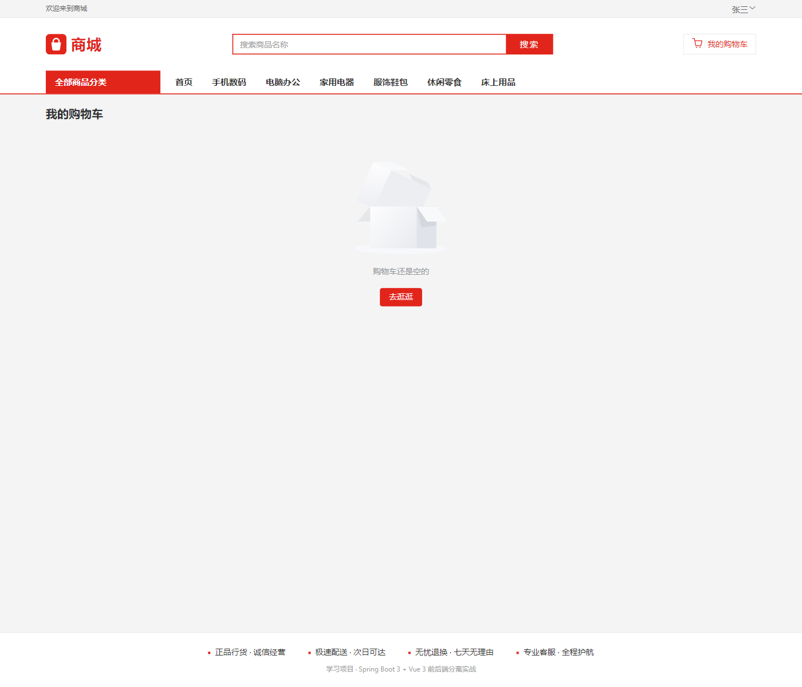
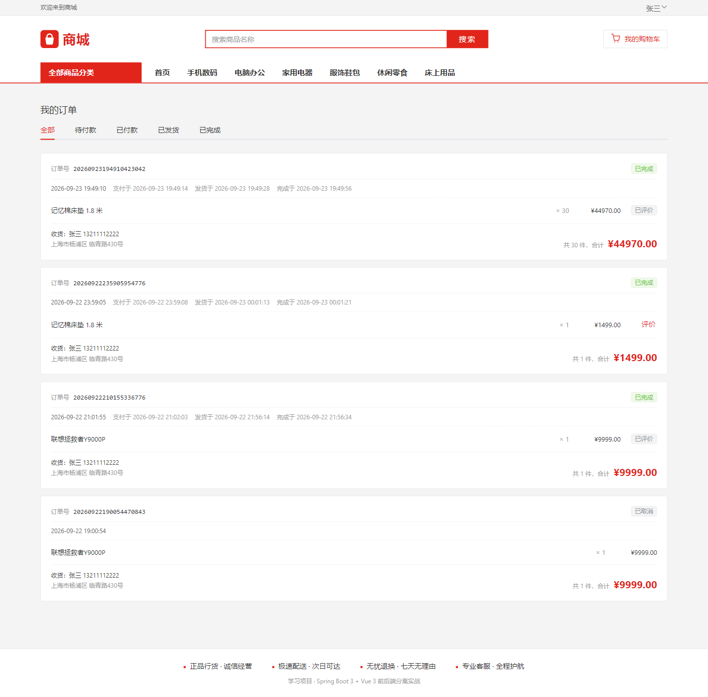

# 商城管理系统

一个**学习用途**的前后端分离商城系统，含**管理端**与**用户端**两侧，从零分 15 个里程碑搭起来。

它能走完一整条真实的交易闭环：

> 注册 → 浏览商品 → 加入购物车 → 填地址 → 下单 → 模拟支付 → 管理员发货 → 确认收货 → 发表评价

---

## 一、这是什么 / 学什么

这个项目的目的**不是**做一个能上线的商城，而是**把一套完整的后端分层和 Spring 生态用法亲手走一遍**。

**学的是**（这三条是搭这个项目时明确的目标）：

- **理解分层与代码设计** —— Controller / Service / Mapper 各自该管什么，一条业务规则该在哪一层定义、在哪一层强制；
- **完整跑通一个系统** —— 不是零件演示，而是一个从建库到前端页面的闭环；
- **熟悉 Spring 生态用法** —— Spring Boot、Spring MVC、MyBatis、拦截器、AOP 式横切（全局异常处理）、定时任务。

**刻意不侧重**：SQL 与表设计。表结构讲解点到为止（10 张表都建了，但不追求复杂范式），因为这不是这个项目的学习目标。

**规模**（数字都是写这份 README 时当场数出来的）：

| 项 | 数量 |
|---|---|
| 后端 Java | 125 个文件 / 18,494 行 |
| MyBatis XML 映射 | 13 个文件 / 2,442 行 |
| 管理端前端 `mall-web` | 21 个源文件 / 5,010 行 |
| 用户端前端 `mall-shop` | 34 个源文件 / 11,662 行 |
| 测试与工具脚本（Python） | 约 14,700 行 |
| 数据库表 | 11 张 |
| REST 端点 | 48 个 |
| Controller | 16 个 |
| 种子商品 | 100 件，配 100 张商品图；每条商品各配一条默认 SKU（共 100 条 SKU） |

> 合计约 5.2 万行。数量本身没有意义，列出来只是让人对体量有个概念。

**⚠️ 这份 README 只是目录和索引。** 这个项目里真正值钱的东西是散落在源码里的成段中文论证 ——
一个设计为什么这么做、另一个做法为什么被否掉、踩过什么坑。见 [第十节](#十这个项目里最值钱的东西是代码注释)。

---

## 二、技术栈

| 工程 | 技术 | 端口 |
|---|---|---|
| `mall-server` | Spring Boot 3.5.16 · Java 21 · MyBatis (原生 XML) · MySQL 8 · Maven · Lombok | **8080** |
| `mall-web` | Vue 3.5 · Vite 8 · Element Plus 2.14 · Pinia 4 · vue-router 5 · axios | **5173** |
| `mall-shop` | 同上 | **5174** |
| 中间件 | MySQL 8.0（业务数据）· Redis（购物车） | 3306 / 6379 |

**几个选型理由**（都是刻意的，不是随手挑的）：

- **Spring Boot 3.5.16 而不是最新的 4.x** —— 3.x 的中文资料和排错答案远多于 4.x。
  对一个学习项目来说，**撞坑之后能搜到答案**比用上最新版更重要。
- **MyBatis 用原生 XML，刻意不用 MyBatis-Plus** —— 目的是看清 Mapper 层到底在做什么。
  MyBatis-Plus 会把 SQL 藏起来，而这恰恰是想学的部分（动态 SQL、`<foreach>`、`resultMap`、
  `useGeneratedKeys` 的边界……）。
- **购物车用 Redis 而不是 MySQL** —— 学习目的（想练缓存），同时也是合理的工程选择：
  购物车是高频读写的临时数据，用 Hash 存 `mall:cart:{memberId}`，30 天滑动过期。
- **登录态用 JWT 而不是 Session** —— 前后端分离下天然契合，服务端无状态。
  ⚠️ JWT 必须带 `type` claim（`ADMIN` / `MEMBER`）：`admin_user.id` 和 `member.id` 都可能等于 1，
  不带类型就能拿会员 token 冒充管理员。
- **`spring-security-crypto` 而不是 `spring-boot-starter-security`** —— 只需要 BCrypt 一个功能，
  引入整个 starter 会连带一整套自动配置的过滤器链，和本项目自己写的拦截器打架。

---

## 三、快速开始

这一节是全文唯一「必须照着做」的部分。

### 1. 前置环境

| 依赖 | 要求 |
|---|---|
| JDK | **21** |
| Maven | 3.9+ |
| Node.js | 18+ |
| MySQL | **8.x**，`root` / `123456` |
| Redis | 6379 |

> ⚠️ **Redis 必须是名为 `mall-redis` 的容器。**
> ```bash
> docker run -d --name mall-redis -p 6379:6379 redis
> ```
> 容器名不能随便改 —— 6 个测试脚本要用 `docker exec mall-redis redis-cli` 直连它清 key，
> 名字不对那些脚本会失败。这是一个真实且不显然的前置条件。

### 2. 建库

**全新安装**（库里什么都没有）：跑全量脚本 `sql/mall.sql`，它会建好 10 张表并塞入种子数据。

> ## ⚠️ `sql/mall.sql` 是 **DROP 重建**脚本
> 它会先 `DROP` 掉所有表再重建。**只能用于全新安装，
> 绝不要对一个已经有数据的库执行** —— 那会清空里面的一切。

**已有的库**（已经有数据，想让表结构跟上）：按顺序各跑一次增量迁移脚本：

```
sql/migration-08-order.sql
sql/migration-08b-idempotency-scope.sql
sql/migration-08c-shop-catalog.sql
sql/migration-08d-shop-catalog-2.sql
sql/migration-09-payment.sql
sql/migration-10-ship.sql
sql/migration-11-product-image.sql
sql/migration-12-review.sql
```

> ### 补充：商品目录是怎么来的
> `08c` 和 `08d` 这两份**不是手写的**，是 `sql/gen-shop-assets.py` 生成的
> （一次产出商品图 `.svg`、迁移脚本、和 `mall.sql` 的种子片段）。
> 手抄 100 行 INSERT 和 100 个文件名，总有一天会把某个商品的封面配错，
> 而那种错误在页面上看起来完全正常 —— 只是画的是另一件商品。
> 要加商品，照 `PRODUCTS_BATCH_2` 的样子加一份新批次，再跑一遍生成器；
> ⚠️ 但 `08c` / `08d` 已经跑过、**已冻结**，生成器不会再改写它们。

> ### ★ 改动 schema 时，上面两份**都要改**
> - `mall.sql` 改它，是为了「新人拿到项目能一键建库」；
> - `migration-XX-*.sql` 改它，是为了「已有数据的库能跟上」。
>
> 只改一份的后果是**新人装的库和开发机的库悄悄分叉**，
> 而两份 `SHOW CREATE TABLE` 长得一模一样的时候，没有人会发现。
>
> ⚠️ 另外：DDL 里的 `COMMENT` 也是注释，但**它被存进了数据库**。
> 改 `.sql` 文件只影响以后新建的库，已经建好的库里那份仍是旧的
> （`SHOW FULL COLUMNS` 和 `mysqldump` 都会把它导出来）。**两处都要改。**

### 3. 启动三个工程

```bash
# 后端（⚠️ 工作目录必须是 mall-server/，见下）
cd mall-server && mvn spring-boot:run

# 管理端
cd mall-web && npm install && npm run dev

# 用户端
cd mall-shop && npm install && npm run dev
```

> ⚠️ **后端的工作目录必须是 `mall-server/`。**
> 配置里上传目录是相对路径 `./uploads`，工作目录不对的话图片会落到别的地方，
> 表现是上传成功但页面显示不出图。

### 4. 默认账号

| 角色 | 用户名 | 密码 |
|---|---|---|
| 管理员（管理端 :5173） | `admin` | `123456` |
| 演示会员（用户端 :5174） | `zhangsan` | `123456` |
| 演示会员 | `lisi` | `123456` |
| 演示会员 | `wangwu` | `123456` |

---

## 四、界面

管理端（`mall-web`，:5173）：

| 登录 | 商品管理 |
|---|---|
|  |  |

| 订单管理 | 商品评价 |
|---|---|
|  |  |

用户端（`mall-shop`，:5174）：

| 首页 | 商品详情（含评价） |
|---|---|
|  |  |

| 购物车（空态） | 我的订单 |
|---|---|
|  |  |

> ⚠️ **截图里是真实的数据** —— 商品、会员、订单都来自开发机上那个库。
> 这个仓库如果将来要公开，这些图会带着数据一起出去。
> 删掉它们只需要删除 `docs/screenshots/` 并移除本节和下表的引用，不影响任何代码。
>
> 购物车那张是**空态**：截图时用的是只读流程，没有往购物车里加任何东西。

---

## 五、项目结构

```
java/
├── mall-server/                    后端（Spring Boot）
│   └── src/main/
│       ├── java/com/example/mall/
│       │   ├── controller/
│       │   │   ├── admin/          管理端接口（6 个）
│       │   │   └── shop/           用户端接口（9 个）
│       │   ├── service/            业务规则在这层定义，且只定义一次
│       │   ├── mapper/             MyBatis 接口
│       │   ├── entity/             和表一一对应的对象
│       │   ├── dto/                接收入参
│       │   ├── vo/                 返回给前端的视图对象
│       │   ├── common/             统一响应体、全局异常处理、业务码
│       │   ├── config/             WebMvc、Jackson、Redis、定时任务配置
│       │   ├── interceptor/        两个鉴权拦截器
│       │   └── util/               JWT、用户上下文
│       └── resources/
│           ├── mapper/*.xml        SQL 都写在这（13 个文件）
│           └── application.yml
├── mall-web/                       管理端前端（Vue 3）
├── mall-shop/                      用户端前端（Vue 3）
├── sql/                            建库脚本 + 增量迁移 + 测试脚本
├── tools/                          辅助工具（截图、支付夹具）
└── docs/screenshots/               README 用的界面截图
```

**★ 为什么按 URL 前缀把 Controller 分成 `admin` / `shop` 两个包？**

因为两边**能看到的数据和权限完全不同**：管理端能看所有会员的订单，用户端只能看自己的；
管理端能改商品，用户端只能读。混在一个包里会变成一堆 `if (isAdmin)`，
而且**没法按路径一刀切加拦截器** —— 而现在 `AdminAuthInterceptor` 拦 `/api/admin/**`、
`MemberAuthInterceptor` 拦 `/api/shop/**`，各管各的，一行路径通配就够了。

其余几层的说明，见各包下的类注释。

---

## 六、权限边界

**认证方式**：JWT 放在 `Authorization: Bearer <token>` 请求头里，由两个拦截器校验。

| 路径 | 要求 |
|---|---|
| `/api/admin/**` | 管理员 token（`type = ADMIN`） |
| `/api/shop/**` | 会员 token（`type = MEMBER`） |
| `/uploads/**` | **公开，无鉴权** |
| `/api/health/ping` | 公开（不在任何拦截器的路径范围内） |

**被排除在鉴权外的匿名路径共 7 条**（原文照抄自 `WebMvcConfig`）：

```
/api/admin/auth/login          ← 管理端唯一一条

/api/shop/auth/register        ← 注册完即登录，本来就还没有 token
/api/shop/auth/login
/api/shop/products             ← 游客可浏览商品
/api/shop/products/**          ← 含商品详情、商品评价列表
/api/shop/categories           ← 游客可按分类筛选
/api/shop/skus/**              ← 规格读取（里程碑 15 阶段 3 新增，见下）
```

> ### ⚠️ 这张清单是**人工维护**的，而路径匹配是**自动**的
> 两者一旦不同步，后果是**要么把该保护的接口公开出去，要么把公开接口锁死**，
> 而且都不会报错。**新增一棵匿名可读的路径树时必须回来补一行**
> —— 只往已有的树里加接口是自动的，新开一棵永远不是。
>
> 这条规矩在里程碑 15 身上应验了一次，而且是**反面**的：
> SKU 读取接口挂在一棵新树 `/api/shop/skus/**` 上，一个字都没沾到这份清单，
> 于是拦截器把它当成要登录的接口 —— 测试当场拿到 401。
> **注意这次清单并没有「说假话」，它什么都没说**：权限照旧生效，只是生效成了错的那一种。
>
> 反过来的一条是**红线**：**上传接口必须挂在有鉴权的路径树下**。
> `POST /api/admin/images` 和 `POST /api/shop/images` 都要求登录 ——
> 挂错地方等于任何人都能往服务器上写文件。
>
> ★ 一个反直觉的例子：`ShopReviewController` 类前缀是 `/api/shop`，
> 它里面 `GET /api/shop/products/{id}/reviews` 因为**落在排除树的覆盖范围内**而匿名可读，
> 而 `POST /api/shop/reviews` 落在一条**全新的、没被排除的**路径树里所以必须登录。
> **同一个类里两个方法权限不同 —— 决定权在这个配置里，不在那个类里。**
>
> ★ 那 `/api/shop/skus/**` 凭什么匿名？判据不是「现在有没有游客调它」（暂时没有），
> 而是**它泄露的东西是不是已经匿名可得了**：它返回的每个字段，
> 商品详情接口原样都返回，所以放开它的**新增**泄露是零。
> 哪天有人往这个响应里加了详情接口没有的字段（成本价、真实进货量），这条理由就作废了。

**★ 为什么 `/uploads/**` 是公开的？**

因为 `` 发不出 `Authorization` 请求头。图片要么公开，要么就得把 token 塞进 URL
（那更糟）。商品图本来就该公开，所以这不是漏洞，是权衡后的选择。

---

## 七、15 个里程碑

每一轮都要求**可运行、可验证**，而不是「写完就算」。表里记的是那一轮**真正学到的东西**。

| # | 里程碑 | 这一轮的知识点 |
|---|---|---|
| 1 | 骨架 + 建库建表 | 分层骨架、统一响应体、连上数据库 |
| 2 | 商品 CRUD 全链路 | 讲得最细，作为后续所有功能的模板 |
| 3 | 分类管理 + `/api/admin` 前缀改造 | 路径前缀作为权限边界 |
| 4 | 管理端登录 + JWT + 拦截器 + 路由守卫 | 前后端如何各自守住「未登录不能进」 |
| 5 | 用户端工程 + 会员注册登录 | 第二套拦截器；JWT 的 `type` claim 为什么是必需的 |
| 6 | 商品浏览（列表 / 详情 / 筛选 / 搜索 / 排序） | 匿名可读的边界划在哪；筛选条件放进 URL |
| 7 | **购物车（Redis）** | 缓存的数据结构选择；**只存 id 和数量，价格永远现查** |
| 8 | **下单流程** | 事务、`UPDATE ... WHERE stock >= ?` 的影响行数、价格快照、幂等键的作用域 |
| 9 | **模拟支付 + 取消 + 超时自动取消** | **两条条件 UPDATE 就是并发防护本身**；顺序反过来会让库存凭空翻倍 |
| 10 | 我的订单 + 管理端订单管理 | 状态机闭环；**确认收货绝不归还库存**（和取消恰好相反） |
| 11 | 商品图片上传（多图图集） | 魔数校验而非信任文件名；**图集的三态 `null` / `[]` / `[...]`** |
| 12 | 商品评价 | **一条不变量交给数据库**（`UNIQUE KEY`）而不是 Service 里的查重 |
| 13 | 收尾：统一异常完善 + README | 协议错误与业务结果的边界；一条只在注释里的规则等于没有规则 |
| 14 | 清账：金额显示收口 + 注释纠偏 | **同一个事实有两份实现，就一定会分岔** —— 清出 4 份 `toFixed(2)` 副本 + 4 处裸渲染 |
| 15 | **商品多规格（SKU）** | **一个字段只能有一个定义者**；`spec_json` 的规范化是唯一索引的前提；**语义变了的数据不能迁移，只能作废** |

★ 标出的几轮是全项目技术含量最高的部分。

**几个值得单独拎出来的设计**：

- **订单明细存价格和商品名快照**，不是每次 `JOIN` 商品表取现价 ——
  因为商品会改价、会下架、会被删，而历史订单必须永远显示当时的价格。
  里程碑 15 又给它加了第三样快照：`sku_spec`（当时买的是哪个规格）。
- **扣库存用 `UPDATE product_sku SET stock = stock - ? WHERE id = ? AND stock >= ?` 判断影响行数**，
  不是「先查够不够再改」。后者在并发下必然超卖。
- **支付的幂等不需要幂等键**。下单的副作用是「新增一行且能无限新增」，所以要键；
  支付的副作用是「把一行从 A 推到 B」，`WHERE status = 0` 第二次天然拿到 0 行。
  **当「目的状态已经达成」可以被检测出来时，就不需要额外的幂等键。**
- **有些不变量只有数据库能真的保证**。「一条订单明细只能评一次」写在 Service 里挡不住并发
  （两个请求可以同时查到「没评过」），所以它是一个 `UNIQUE KEY`。
  里程碑 15 的 `uk_product_spec (product_id, spec_json)` 是同一个理由的第二次应用。
- **★ 里程碑 15 那条最贵的教训：「加一列」不影响任何现有代码，「收紧约束」必然影响。**
  迁移脚本因此拆成了两步（`migration-13-sku.sql` 只加不删 / `13b` 才删列、才 `DROP DEFAULT`）。
  第一版把 `DROP DEFAULT` 写进了 13，跑测试时**每一次下单都 500**（`ERROR 1364`）——
  因为当时 Java 侧的 `batchInsert` 列清单里还没有那一列。**它不静默，但会被误读成「迁移把系统搞坏了」。**
- **★ 价格和库存的唯一真源是 `product_sku`。** `product` 表上不汇总一份库存 ——
  汇总列就是第二个写入者，而库存在事务里被并发扣减，汇总必然漂移，
  这个项目有 20 线程并发抢库存的测试，漂移一定被测出来。

---

## 八、接口一览

统一约定：**业务结果返回 HTTP 200 + `body.code`；协议错误（路径、方法、报文格式不对）
返回真正的 HTTP 状态码。**

响应体形状：

```json
{ "code": 200, "message": "success", "data": { } }
```

> ⚠️ Jackson 配了 `default-property-inclusion: non_null` —— **值为 `null` 的字段会直接从 JSON 里消失**，
> 不是变成 `null`。前端读到 `undefined` 时，要先想清楚是「本来就没有」还是「后端漏给了」。

`code` 的取值：`200` 成功 · `400` 参数/协议问题 · `401` 未登录 · `403` 无权限 · `1001`~`1008` 业务错误 · `500` 服务端异常。

### 管理端 `/api/admin/**`（18 个）

| 方法 | 路径 | 登录 | 说明 |
|---|---|---|---|
| POST | `/api/admin/auth/login` | — | 管理员登录，返回 token |
| GET | `/api/admin/auth/me` | ✓ | 当前管理员信息（刷新页面用） |
| GET | `/api/admin/products` | ✓ | 商品分页列表（可见下架商品） |
| GET | `/api/admin/products/{id}` | ✓ | 商品详情（含图集、`specSchema` 和 `skus`） |
| POST | `/api/admin/products` | ✓ | 新增商品（**连规格一起**，见下） |
| PUT | `/api/admin/products/{id}` | ✓ | 修改商品（规格是**整集合替换**） |
| DELETE | `/api/admin/products/{id}` | ✓ | 删除商品（级联五级：晒图 → 评价 → 图集 → **SKU** → 商品） |
| POST | `/api/admin/images` | ✓ | 上传图片（`multipart`，字段名 `file`） |
| GET | `/api/admin/categories` | ✓ | 分类分页列表 |
| GET | `/api/admin/categories/options` | ✓ | 启用中的分类（下拉框用） |
| GET | `/api/admin/categories/{id}` | ✓ | 分类详情 |
| POST | `/api/admin/categories` | ✓ | 新增分类 |
| PUT | `/api/admin/categories/{id}` | ✓ | 修改分类 |
| DELETE | `/api/admin/categories/{id}` | ✓ | 删除分类（下面还挂着商品时会失败） |
| GET | `/api/admin/orders` | ✓ | 全部会员的订单（按状态/订单号/会员筛选） |
| POST | `/api/admin/orders/{orderNo}/ship` | ✓ | 发货（仅已付款可发货） |
| GET | `/api/admin/reviews` | ✓ | 全部评价（按商品/会员筛选） |
| DELETE | `/api/admin/reviews/{id}` | ✓ | 删除评价 |

### 用户端 `/api/shop/**`（29 个）

| 方法 | 路径 | 登录 | 说明 |
|---|---|---|---|
| POST | `/api/shop/auth/register` | — | 注册（注册完即登录） |
| POST | `/api/shop/auth/login` | — | 登录 |
| GET | `/api/shop/auth/me` | ✓ | 当前会员信息 |
| GET | `/api/shop/products` | — | 商品列表（搜索/分类/排序/分页） |
| GET | `/api/shop/products/{id}` | — | 商品详情（含 `specSchema` 和 `skus`） |
| GET | `/api/shop/products/{id}/reviews` | — | 某商品的评价列表 + 星级分布 |
| GET | `/api/shop/skus/{skuId}` | — | 单个规格（结算页/立即购买要按 skuId 现查价） |
| GET | `/api/shop/categories` | — | 启用中的分类 |
| GET | `/api/shop/cart` | ✓ | 查询购物车 |
| GET | `/api/shop/cart/count` | ✓ | 购物车件数（顶部角标） |
| POST | `/api/shop/cart/items` | ✓ | 加入购物车（数量为**增量**） |
| PUT | `/api/shop/cart/items/{skuId}` | ✓ | 修改数量 |
| DELETE | `/api/shop/cart/items/{skuId}` | ✓ | 移除一件 |
| DELETE | `/api/shop/cart` | ✓ | 清空购物车 |
| GET | `/api/shop/addresses` | ✓ | 我的地址列表 |
| GET | `/api/shop/addresses/default` | ✓ | 我的默认地址 |
| POST | `/api/shop/addresses` | ✓ | 新增地址 |
| PUT | `/api/shop/addresses/{id}` | ✓ | 修改地址 |
| PUT | `/api/shop/addresses/{id}/default` | ✓ | 设为默认（幂等，所以用 PUT） |
| DELETE | `/api/shop/addresses/{id}` | ✓ | 删除地址（幂等） |
| POST | `/api/shop/orders` | ✓ | 购物车结算下单（请求体是 `skuIds` + 幂等键） |
| POST | `/api/shop/orders/buy-now` | ✓ | 立即购买（请求体是 `skuId`） |
| GET | `/api/shop/orders` | ✓ | 我的订单（只能是自己的） |
| GET | `/api/shop/orders/{orderNo}` | ✓ | 订单详情（用订单号，不是自增 id） |
| POST | `/api/shop/orders/{orderNo}/pay` | ✓ | 模拟支付 |
| POST | `/api/shop/orders/{orderNo}/cancel` | ✓ | 取消订单（归还库存） |
| POST | `/api/shop/orders/{orderNo}/complete` | ✓ | 确认收货（**不**归还库存） |
| POST | `/api/shop/images` | ✓ | 上传晒图（和 admin 侧形状一致） |
| POST | `/api/shop/reviews` | ✓ | 发表评价 |

### 其他

| 方法 | 路径 | 登录 | 说明 |
|---|---|---|---|
| GET | `/api/health/ping` | — | 健康检查（验 Tomcat → Spring MVC → 数据库整条链路） |

---

## 九、测试怎么跑

测试脚本都在 `sql/` 下，**用标准库 `urllib` 手写，不依赖 `requests`**，
每个脚本独立可跑、自带清理。跑之前三个服务必须在运行。

```bash
cd sql
/d/python/python.exe test-order.py       # 或者你本机的 python
```

- 输出 `结果：N 通过 / M 失败`，**失败时进程退出码是 1**（可以直接串进 CI）。
- 脚本之间**不共享代码** —— 公共辅助函数是复制过去的，不是 import 的。
  这样任何一个脚本都能单独跑、单独改，不会因为动了公共库而连带影响别的脚本。

**15 个脚本，约 1,200 个断言点**（★ 标的是那个脚本里最值钱的一条）。

| 脚本 | 测什么 |
|---|---|
| `test-auth.py` | 管理端登录与拦截器；★ **自己伪造 JWT** 来验证「会员 token 不能冒充管理员」 |
| `test-category.py` | 分类 CRUD、重名、删除时下面还挂着商品的拒绝 |
| `test-shop-product.py` | 商品浏览、搜索、筛选、排序；★ 下架商品对用户端**完全不可见**（配对照组） |
| `test-cart.py` | 购物车；★ **直接看 Redis 里到底存了什么**（不靠猜）、改价后立刻跟着变、下架商品标记失效而不是消失 |
| `test-address.py` | 地址 CRUD；★ 水平越权（三个入口）与「最多一个默认地址」不变量 |
| `test-order.py` | 下单、价格快照、**20 线程并发抢库存**、幂等键的作用域、事务回滚 |
| `test-pay.py` | 支付、**12 线程并发取消**；★ 超时是 SQL 里的业务规则，**不依赖定时任务** |
| `test-member.py` | 会员注册登录；★ **参数白名单**（注册时塞 `status` 不能生效）与跨端越权 |
| `test-order-list.py` | 订单列表分页、状态筛选、发货/确认收货；★ **确认收货绝不还库存**（直查库） |
| `test-upload.py` | 上传：魔数校验、路径穿越、大小上限；★ 图集的 `null` / `[]` / `[...]` 三态 |
| `test-review.py` | 评价资格判定、**20 线程并发评同一条明细**；★ **直插库**验证不变量由唯一索引保证 |
| `test-sku.py` | 规格：唯一索引与规范化、叉乘漏行、**20 线程并发买同一个 skuId**、取消订单**还给正确的那一行**、历史孤儿明细；★ **跑完不留无主行**（见下） |
| `test-exception.py` | 全局异常处理器：状态码矩阵、`Allow` 头、406 的空 body 契约（**唯一不写库的脚本**） |
| `test-frontend-contract.py` | **前端的假设**（和上面 13 个问的不是同一个问题，见下） |
| `test-frontend-format.py` | **前端的写法**（也不打接口；★ 不需要后端 / MySQL / Redis 就能跑，见下） |

> ### ★ `test-sku.py` 里最贵的一条，是一个**动态证明 + 静态读源码**的组合
> 「同一件商品换了规格之后必须换幂等键」这条规则，**在 HTTP 报文里完全看不出来**：
> 用同一个键提交「黑色」再提交「白色」，后端分不出来，它只会把上一单原样返回 ——
> 接口 200、跳转成功、金额不对。所以那个脚本做两件事：
> 先用两个真实请求把「后端确实分不出来」这件事**演一遍**（断言只有一笔订单、且返回的是上一笔），
> 再**读出 `checkoutIntent.js` 的源码**断言签名里算了 `skuId` 而不是 `productId`。
> 这是第一次有脚本去打接口之外的东西来守住一条规则。
>
> ⚠️ **不写「恰好 N 项」**。脚本改过之后，这个数字立刻就旧了。
> 看真实数字就自己跑一遍 —— 那是唯一不会过期的来源。

**★ 三类脚本问的是不同的问题**：

- 前 13 个 `test-*.py` 问的是「**后端行为对不对**」；
- `test-frontend-contract.py` 问的是「**前端的假设对不对**」——
  接口返回的字段名前端读得到吗？前端发的 body 后端收得下吗？
- `test-frontend-format.py` 问的是「**前端的写法对不对**」——
  金额有没有走那唯一一份格式化函数。**它读源码，不打接口。**

后两者存在的理由不一样：

`test-frontend-contract.py` 针对的是**前端没有类型检查**。字段名写错只会得到 `undefined`，
构建不报错、ESLint 不报错、页面也未必立刻崩 —— **这类 bug 只有契约测试能提前发现。**

`test-frontend-format.py` 针对的是一件更窄但更绝对的事：
**有些修复在 HTTP 报文里一个字节都看不见**。里程碑 14 修的是「拿到数字之后怎么印」，
接口返回的 JSON 完全没变 —— 所以那 12 个打接口的脚本**全都证明不了它修好了**。
能守住它的只有两样：这个脚本，和浏览器里肉眼看到的那个数字。
（那个脚本的 docstring 把这件事写全了，值得一读。）

> ### ★ 一个提醒：警惕「占位断言」
> 早期里程碑里写过一些「某接口 → 404（因为 Controller 还没做）」的断言。
> 它们测的其实是**当时的实现进度**，而不是业务规则 —— 里程碑推进后必然失败。
> 看到这类失败，先问「它是不是在测进度」，再决定改代码还是改断言。

> ### ★★ 一个没有断言的清理逻辑，等于没有清理逻辑
> 里程碑 15 阶段 6 收尾时数了一遍库，发现 `orders` 比它应有的样子多了 90 笔，
> 全部指向**已经不存在的会员**，`member_address` 多 33 条，同一个来源。
>
> 根因只有一行 —— `test-sku.py` 的 `main()` 里两行的顺序写反了：
>
> ```python
> member_setup()   # 先注册一个会员
> cleanup()        # 再把它删掉  ← 而 cleanup 的最后一句正是「删会员」
> ```
>
> `cleanup()` 删订单用的是 `DELETE o FROM orders o JOIN member m ON m.id = o.member_id
> WHERE m.username LIKE 'skutest%'` —— 这个写法有个**隐含前提：那个会员行还在**。
> 会员行被自己删掉之后，这三条 join 从此永远匹配 0 行：
> **删掉了会员，却把它的订单、明细、地址全留在了库里，一句错都不报。**
>
> **它能藏十几轮，靠的是三件事同时成立**：
> 1. 155 条断言全在问「接口做了它该做的事」，**没有一条在问「脚本自己有没有留垃圾」**；
> 2. JWT 认证**只验签名、不查库**，所以一个已经不存在的会员照样能下单、能取消、能看购物车 ——
>    C/D/E 三组整个是在一个**幽灵会员**名下跑完的，全部通过；
> 3. 症状（库里多几行）和断言（HTTP 200 + 业务码）在**两个不同的层面上**，谁也不会提醒谁。
>
> **修法两处**，缺一不可：
> - `cleanup()` 增加「**按 id 删**」：`DELETE FROM orders WHERE member_id = ？`。
>   用户名那条线索在会员被删之后**就永久失效了**（找不回一个不存在的用户名），
>   可靠的那条线索是 id —— 它在注册时就拿到了，不依赖会员行是否还在。
> - `main()` 改成 `cleanup()` → `member_setup()`：先扫上一次的残留，再注册本轮的会员。
>
> 然后再补上**第 3 件事：一条断言**。脚本末尾新增 `junk_snapshot()`：
> 跑之前和跑之后各数一遍「**无主行**」（明细找不到订单 / 订单找不到会员 / 地址找不到会员 /
> SKU 找不到商品 / 残留的测试商品），两者必须**一模一样**。
>
> ★ 为什么数「无主行」而不是行数：行数是会变的（真人也会下单），**无主行不会** ——
> 一个正常的库，孤儿永远是 0。这条断言在修之前会红，在修之后才绿，
> 而它才是这一类 bug **唯一**能被自动发现的地方。
>
> ⚠️ 已经攒下的那 90 笔订单 / 33 条地址的会员行早就没了，**按用户名再也找不回来**，
> 只能按 id 逐条清（`/tmp/mall-backup/orphan-*.tsv` 里有备份，id 也在旁边）。
> 这条不是「顺手改了别人的东西」，是**这次泄漏自己的残骸**。

---

## 十、这个项目里最值钱的东西是代码注释

这不是客套。这个项目的写法是：**每一个不显然的决定，都在它所在的那一行旁边写下为什么**，
包括被否掉的其他方案和踩过的坑。README 只是给你一张地图，教材在源码里。

如果要读，建议按这个顺序（每一个文件的类注释都是一篇独立的说明）：

| 文件 | 讲了什么 |
|---|---|
| `common/GlobalExceptionHandler.java` | 协议错误与业务结果的完整边界；一张「哪些异常今天可达 / 哪些不可达」的审计表 |
| `service/impl/OrderServiceImpl.java` | 事务、幂等、价格快照、扣库存、状态机 |
| `config/WebMvcConfig.java` | 权限边界是怎么划的，以及它为什么容易失效 |
| `service/impl/ProductReviewServiceImpl.java` | 「从另一个领域推导出的业务规则」；一条不变量怎么交给数据库 |
| `common/ResultCode.java` | 业务码的划分依据 |
| `resources/mapper/OrderMapper.xml` | 动态查询片段复用、`<foreach>` 的坑、列清单为什么要加表别名 |

> **同一个理由不要写第二遍。** 这个项目为此付出过代价：
> 一句关于图片路径的错误示例被抄了 6 遍，直到有人真的拿它去比对文件系统才发现。
> **两份副本一定会分岔** —— 所以 README 不复述代码注释，只做索引。

---

## 十一、已知的取舍 / 明确不做的事

这一节比它看起来重要：**知道一个系统不做什么，和知道它做什么一样有用。**

| 不做 | 为什么 / 代价 |
|---|---|
| **不加数据库外键** | 加外键之后「删商品」会变成一条可能失败的语句，而约束拦下来的错误只能翻译成一句「系统繁忙」。**代价**：删除顺序必须自己守（晒图 → 评价 → 图集 → **SKU** → 商品），反了会留下孤儿行而且不报错。测试里有专门找孤儿的断言。 |
| **JWT 签发之后无法主动失效** | 服务端**只验签名，不查库**。所以一个已经被删掉的会员，手里那枚 120 分钟内的 token 依然全通：能下单、能取消、能看购物车。**代价**：没有真正的「登出」和「被踢下线」，要做到只能加黑名单或退回有状态会话。**这一条是被一个真实的 bug 逼出来的** —— 见「测试怎么跑」里那次幽灵会员：脚本把会员删了，却用他的 token 跑完了三组用例，全程绿。 |
| **`product` 表上不存价格，也不存库存** | 价格和库存的唯一真源是 `product_sku`（无规格的商品也有一条 `spec_json = '[]'` 的默认 SKU）。**为什么不留一份「汇总库存」**：汇总列就是第二个写入者，而库存在事务里被并发扣减，汇总必然漂移 —— 这个项目有 20 线程并发抢库存的测试，漂移一定会被测出来。**代价**：列表页的 `minPrice` / `totalStock` / `skuCount` 是一次 `GROUP BY` 派生表算出来的，100 件商品规模下可忽略，商品量大了要翻案。 |
| **「保存商品」= 全量覆盖 SKU 库存** | 管理端编辑页保存时提交的是每行的绝对库存值。**代价**：运营打开编辑页时库存 10，期间卖掉 3 件，他一保存库存就回到 10 —— **凭空多出 3 件**，而且两端都显示成功。**真正的修法是「库存调整走增量 ±N」**（单独的接口），明确推迟。当前的处理是在表单上写一行提示 + 记在这里。 |
| **「每个规格最多买 99 件」做不出「每件商品合计 99 件」** | 购物车的 Redis field 从 `productId` 换成了 `skuId` 之后，「这件商品一共加了多少件」不再 O(1) 可得。99 只能是**每个规格各自 99**。 |
| **不做规格级图片 / 规格级上下架 / 动态可选性** | 规格级图片要 `product_image` 加 `sku_id`，是独立的一块；「这个组合不生产」用 `stock = 0` 表达、前端标灰就够；「选完颜色某些尺码变灰」是动态可选性，只做了静态可选性（某个值在任何 SKU 里都不出现才标灰）。 |
| **删记录不删磁盘文件** | 换图、删商品都不删已上传的图片文件。**代价**：磁盘只增不减。理由是把「数据库事务」和「文件系统」绑在一起不可靠。 |
| **评价不能改、不能删** | 业务上定成「一次定终身」。管理端只能整体删除（删掉后那条明细可以重评）。 |
| **不做真实支付 / 物流** | 范围外。支付是模拟的（点一下按钮就成功），没有第三方对接。 |
| **不做秒杀 / 优惠券 / 分布式 / 微服务** | 范围外 —— 这个项目要学的是分层和框架用法，不是分布式。 |
| **不做图片压缩** | 上传只做大小上限（2MB）和格式白名单，不缩放。 |
| **不做三级省市区联动** | 地址的 `region` 就是一个普通文本框。**代价**：地址格式由用户自己保证。 |
| **不做限流 / 配额** | 没有防刷机制。 |
| **SVG 不允许上传** | 虽然它是图片，但能内嵌 `<script>`，是最经典的图片 XSS 载体。白名单只放 PNG / JPEG / GIF / WEBP。 |
| **`test-exception.py` 不搬运已有脚本的断言** | 现有的协议错误断言（散在 `test-review` / `test-upload` / `test-shop-product` 里）一个字都没动。「顺手改掉别人依赖的东西」是协作里最招人烦的一类改动。新脚本测的是**状态码矩阵**（系统性的表），旧断言是**偶然碰到的一例**，两者不是重复。 |

> ### ★ 「汇总库存一定会漂移」这句话，这里有一份实测证据
>
> 迁移期间 `product.price/stock` 被留下来当回滚预案，由管理端保存时**按 SKU 汇总回写**。
> 于是同一个事实暂时有了两个写入者 —— 而**它真的分岔了**：
>
> ```
> 商品 683「佳能 EOS R50 微单套机」   product.stock = 29    product_sku.stock = 30   ← 差 1
> 全库 100 件商品里，只有这 1 件对不上
> ```
>
> 分岔的过程可以逐条对上，**而且每一步单独看都是"对的"**：
> 种子里两个值都是 30（`sql/mall.sql` 的 SKU 种子段）；21:57 有一笔订单下单，
> 那时下单路径还在扣 `product.stock`（里程碑 15 阶段 4 之前），于是它变成 29；
> SKU 那一行是阶段 1 回填的，之后没人动过，还是 30。
>
> **值得记住的不是"差了一个数"，而是这件事的性质**：
> 两个写入者各写各的，**没有一方报错、没有一条日志、也没有任何接口能看出来** ——
> 我是拿一句 `p.price <> s.price OR p.stock <> s.stock` 主动去比对才发现的，
> 而且它甚至解释不了自己是**什么时候**变的（那笔订单的 `sku_id` 是 NULL，
> 按新模型它根本不会去动任何 SKU 行）。
>
> 结论就是本节第二行那条不变量：**一个字段只能有一个定义者。**
>
> ### ★★ 而删列【没有】修好这条数据 —— 这一点必须写清楚
>
> 阶段 6 删掉那两列之后，29 这个数不存在了，剩下的 30 成了唯一答案。
> 看起来"问题解决了"，但**真正被解决的是"能被发现"，不是"数据是对的"**：
>
> ```
> 那笔订单（order 913，已付款 4799.00）真的卖掉 1 台，
> 而这台相机现在的库存显示 30 —— 多算了一件。
> ```
>
> 删列只是**把分歧定格在其中一个值上**，然后让它再也无法被观察到。
> 如果那 1 件是最后一件库存，这条差异就是"超卖一件"。
>
> ★ 所以正确的顺序本来是**先对账、再删列**：
>   1. `p.price <> a.mn OR p.stock <> a.sm` 找出所有对不上的行（当时只有 1 件）
>   2. 逐条判断哪个值是真的（这里显然是 29 —— 订单在库、库存就该少 1）
>   3. 把那 1 行改对，让两个值一致
>   4. 再删列
>
> ### ★ 后来补做了第 3 步（2026-09-24，用户拍板）
>
> 删列时**没有做第 3 步**，因为它是"改用户库里的真实数据"，属于要显式拍板的事 ——
> 于是它先是作为一条已知的、量化的差异留在这里。用户拍板后已改对：
>
> ```sql
> UPDATE product_sku SET stock = 29 WHERE id = 52;   -- 商品 683 唯一的（默认）SKU
> ```
>
> 改之前先核对了三件事，缺一条都不能改：
> · 商品 683 只有这一条 SKU（`spec_json = '[]'`，`price` 4799.00），**不存在改错行的可能**；
> · order 913 是 `status = 3`（已完成）、`pay_time` 有值、`cancel_time` 为 NULL —— **真的成交了**，
> 它的明细 `quantity = 1`、`sku_id` 是 NULL（里程碑 13 之前下的单，按设计就该是 NULL）；
> · 那条明细上挂着 1 条真实评价 —— 顺带证明这单不是一个测试夹具。
>
> ⚠️ 这条 UPDATE 是**手工**执行的，不在任何迁移脚本里：迁移链重放不出来它
> （新建的库从一开始就只有一个写入者，不会有这个分歧）。
> **所以它只存在于这里和线上库里** —— 换台机器重建环境不会重现这个数。
>
> ★ 更一般地说：**删掉冗余副本不解决副本里的分歧，它只是让分歧不再可见。**
>   删之前对一次账，是这一步唯一需要的额外工作 ——
>   而它恰好是最容易跳过的一步，因为"删掉就好了"看起来就是终点。
>   这次的代价是：漂移被定格了 1 天，而**对账的证据（`product.stock` 那一列）已经不存在了**，
>   只能靠订单反推 —— 这也是为什么上面那段核对要写得这么细。

---

## 附：几个容易踩的坑（写给未来的自己）

- **`sql/mall.sql` 永远不能对已有数据的库跑**（见第三节）。
- **后端工作目录必须是 `mall-server/`**，否则 `./uploads` 会落到别处。
- **Redis 容器必须叫 `mall-redis`**，否则 6 个测试脚本清不了 key。
- **★ 脚本跑到一半机器休眠 → 一片 401，而且没有清理。** JWT 有效期是 120 分钟，
  脚本在开头登录一次就不管了；机器一睡（合盖、待机）再醒来，那个 token 早就过期，
  后半程全是 `401 登录已过期`。**这个坑的特征是「它只坏一个脚本」**：
  其余脚本是刚启动的、登录是新的，所以全绿 —— 于是看起来像是那一个脚本写错了。
  更坏的是脚本多半在断言失败处 `SystemExit`，**收尾的 `cleanup()` 不会跑**，
  库里留下它的商品和会员。**判据**：看失败是从哪一行开始的 ——
  如果前面几十条断言全过、从某个点起突然全部 401，那不是逻辑问题，是 token 死了。
  重跑一遍就好（脚本开头的 `cleanup()` 会先清掉上一次的残留）。
- **`mysql` 客户端在 Windows 上的命令行参数不吃带引号的 LIKE 模式。**
  `spec_json LIKE '%"黑色"'` 这种写法**恒不匹配**（返回 0 行、不报错），
  而 `LIKE '%黑色%'` 又能匹配 —— 于是这个坑只在「想精确匹配 `"值"` 这个形状」时才踩得到。
  **对策不是记住这个怪癖，而是：能不在 SQL 里拼字符串就别拼**
  （`tools/fixture-pay.py` 里是把行拉回来在 Python 里比，顺带还比子串匹配更严格）。
- **`/tmp` 对 Windows 版 Python 不可见**（那是 Git Bash 的路径），脚本里要用真实路径。
- **时间格式是 `yyyy-MM-dd HH:mm:ss`**，前端 `new Date("2026-09-22 20:48:06")` 是非标准写法 ——
  Chrome 能解析，**Safari 直接给 `Invalid Date`**。前端要 `replace(' ', 'T')`。
- **金额在前端要 `.toFixed(2)`**：后端的 `228.70` 序列化成 JSON 数字会变成 `228.7`，
  不格式化就会出现「同一笔钱在购物车和收银台长得不一样」。
  ⚠️ **但别就地写 `.toFixed(2)`** —— 全工程只有 `mall-shop/src/utils/format.js` 一份实现，
  每一处金额显示都走它的 `formatAmount()`。
  就地再写一份，正是里程碑 14 花一整轮清掉的东西：那次清出**四份**逐字相同的副本，
  外加**四处**绕过它们、裸渲染的金额（`¥599` 和 `¥599.00` 并排出现在同一页上）。
  下一个想就地写的人会被 `sql/test-frontend-format.py` 拦住。
